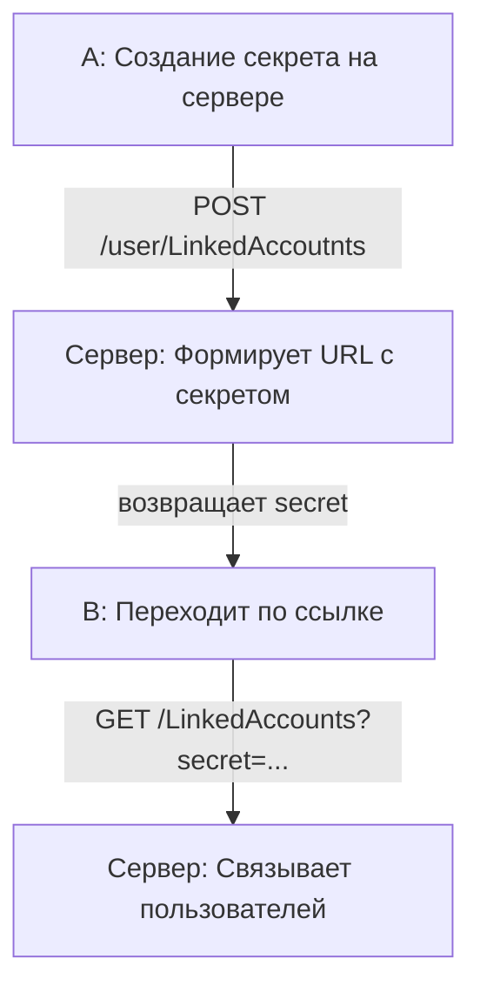

# Связывание по общему секрету

**1. Логика механизма:**
- *(на клиенте)* юзер А делает запрос на сервер что хочет заменить UUID своего аккаунта на UUID юзера Б;
- *(на сервере)* генеририурет урл с общим секретом по которому должен перейти клиент Б
 - *(на клиенте)* клиент Б заходя в свой личный кабинет видит предложение "Хотите подключить акканут А к своему?" если да, то перейдите по ссылке ххх
 - *(на сервере)* при переходе по ссылке связывает Пользователя Б по идентификатору Пользователя А, добавляя данный идентификатор в поле groupUUID таблицы пользователей.

**2. Ограничения, которые проверяет клиентская часть:**
- Не давать возможность отправлять запрос на привязку если есть какой-то тариф (при этом принять запрос можно, так как UUID подписки не теряется).
- Не давать возможность отправлять запрос на привязку если такой тип привязки уже используется (нельзя связывать два аккаунта по двум Яндекс-почтам или двум разным логинам и т.д.)..

**3. Ограничения, которые проверяет серверная часть:**
- Не давать возможность связывать аккаунты, если добавляемый аккаунт уже связан с другим.

**4. Реализация серверной части:**
- Добавить groupUUID в таблицу пользователей.
- Создать таблицу секретов (secret, sourceUserUUID, targetUserUUID, status = ack, syn, fin)
- Реализовать методы для создания и подтверждения связки аккаунтов по секретному ключу.

**P.S.** При реализации метода ля создания и подтверждения связки аккаунтов по секретному ключу, необходимо придерживаться REST-подхода, принятого в проекте. Например:

**Действие А:** 
```http 
POST /user/LinkedAccoutnts  
{  
"email": email  
}
```
**Ответ:**  
```http
201 - created  
{  
email,  
secret,  
linkStatus: "syn" 
}
```
Передаем эту ссылку Б.
**Действие Б:** 
```http 
GET /LinkedAccounts?secret=...
```
**Ответ:**  
```http
201 - created  
{  
email,    
linkStatus: "fin" 
}
```

### Flow-диаграмма связывания по общему секрету



### Плюсы:
- Логика не завязана на сторонние сервисы.

### Минусы:
- Связываемый аккаунт должен быть зарегистрирован в системе.
- Необходимо создать новую таблицу в БД.
- Пользователю А необходимо перезаходить на страницу под пользователем Б для подтверждения привязки.